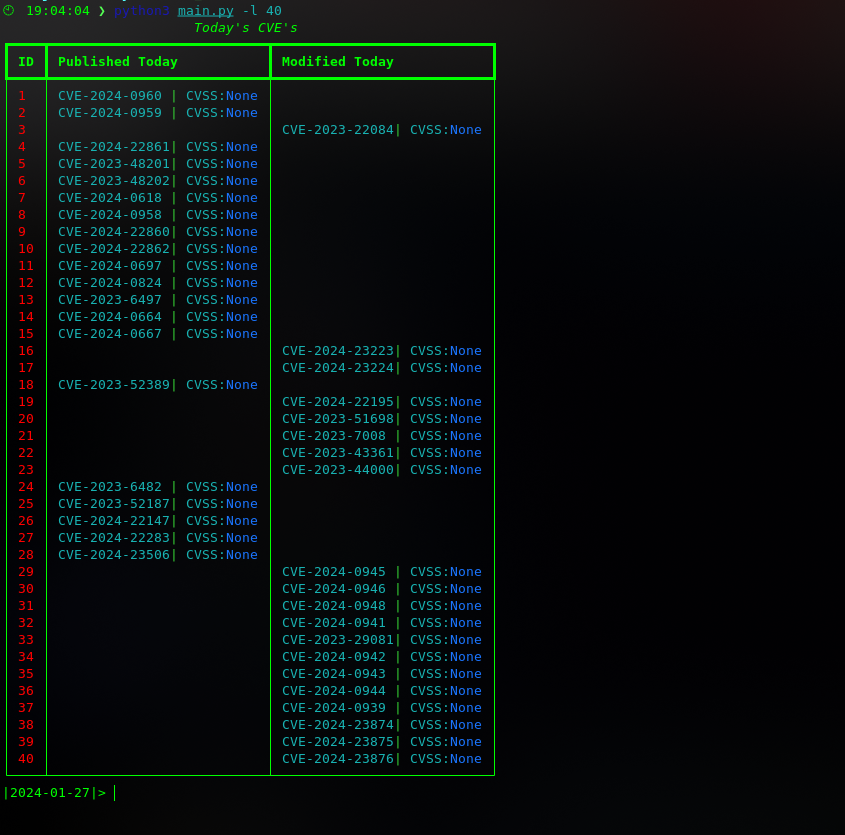
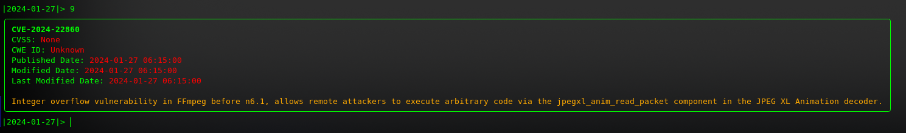
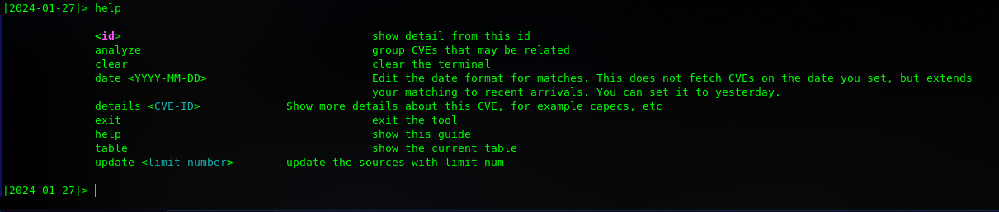
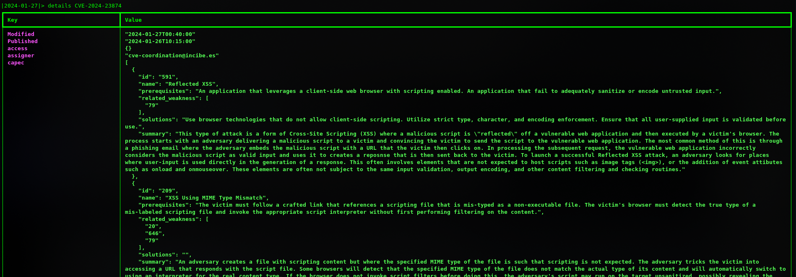
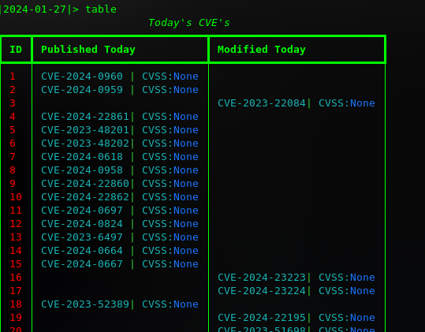
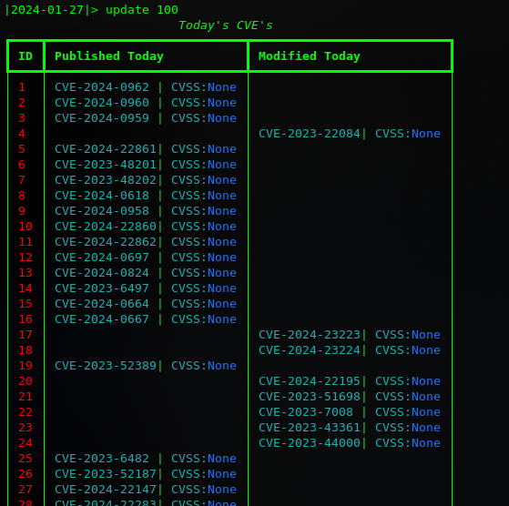
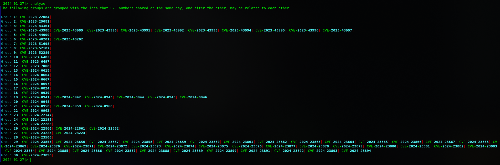
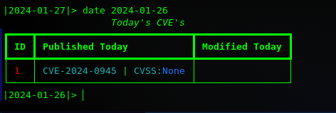

# LuckyQuestor
LuckyQuestor is focused on monitoring CVEs published or modified on CURRENT DAY. It provides an interactive interface in CLI and uses the cve.circl.lu API (API Key not required) for data sourcing. 

## Installation
uses "prompt_toolkit" to get input, "rich" for screen displays and "requests" for http requests. Dependencies can be downloaded from requirements.txt.

## Usage
You must give an argument to the -l parameter to initialize the tool. This limit will pull the last CVEs of that day, as many as you want to see, and save them in the table, categorized as published and modified, and assign an index number to each row. The ones published today are prioritized to be shown in publish, even if they are modified today.
      python3 main.py -l 40
      

You have a table where CVEs are listed. You can access details about each CVE by typing its id.

type help to see options

Typing the id of the CVE gives you a brief summary about it. For more comprehensive information, use the details <CVE-ID> command.
When using the details command you are not restricted to the CVEs listed in the table. You can perform this operation for all CVEs.

If your table is behind the output stacks, you can access the table with the table command:

You can use update if you want to expand or collapse your existing table. This will recreate your table. To do this you need to set a limit again.

Sometimes there are multiple vulnerabilities in a product and they can be expressed by different CVEs. The analyze command helps you to group and parse CVE ids that come one after the other.

LuckyQuestor takes the current day's date as a reference and compares against it when pulling the latest CVEs from its source. To change this date, you can use the "date year/month/day" format command. This command will not retrieve data from that date. It shows you the data that matches that date.

## New Features

### Export Functionality
LuckyQuestor now supports exporting your CVE data in different formats:
- `export json`: Export CVEs to JSON format
- `export md`: Export CVEs to Markdown format

### Enhanced Filtering and Sorting
Powerful filtering options have been added:
- `filter cvss 7.0`: Show CVEs with CVSS score higher than 7.0
- `filter keyword sql`: Show CVEs containing "sql" in their description
- `filter cwe CWE-79`: Show CVEs with specific CWE ID
- `sort cvss`: Sort CVEs by CVSS score
- `sort date`: Sort CVEs by publication date

### Watchlist Management
Keep track of specific vulnerabilities:
- `watch add keyword sql`: Monitor SQL-related CVEs
- `watch add vendor microsoft`: Monitor Microsoft-related CVEs
- `watch add cwe CWE-79`: Monitor specific CWE types

### MITRE Integration
New MITRE framework integration provides deeper vulnerability analysis:
- Risk score calculation based on CVSS and MITRE data
- MITRE ATT&CK pattern mapping
- Mitigation recommendations
- Enhanced CWE information
- Extended filtering with MITRE techniques and tactics
- Comprehensive MITRE analysis in exports

Use `mitre` command to access MITRE-specific features:
- `mitre analyze CVE-ID`: Detailed MITRE analysis for specific CVE
- `mitre techniques`: List available ATT&CK techniques
- `mitre stats`: View MITRE-related statistics

